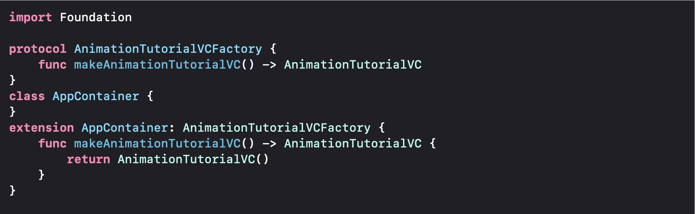
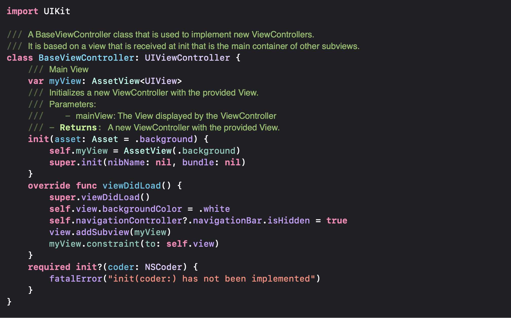
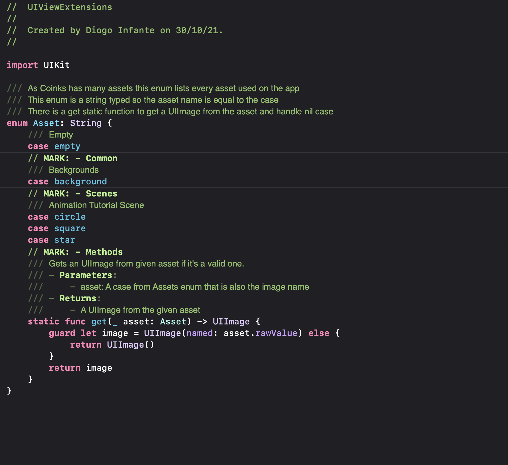
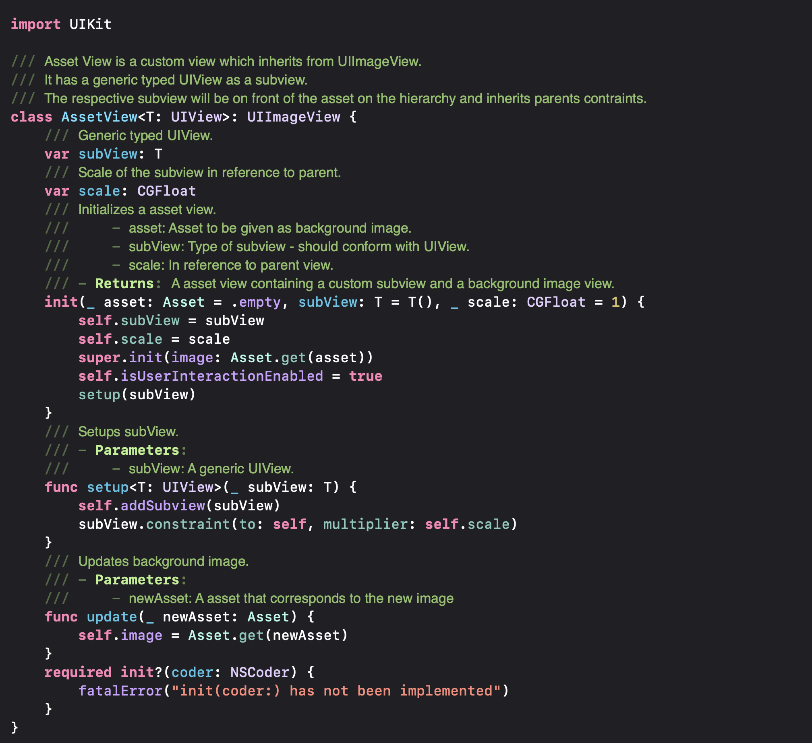

# AdvanceUIKit

## Motivation
This project contains convenient solutions for UIKit apps. It's a product of an insatiable journey to seek Swift's best practices. Since there is always space for improvements, it's in constant update. But I guess it might help some iOS developers and hopefully inspire new ideas.

## Application:
1. **AppContainer**:

Constructing an App Container is a classical way to manage view controller creations. It's a convenient form to get rid of the storyboards and programmatically instantiate VCs. It also serves wall to dependencies management and inits parameters.
 
 
 
2. **BaseViewController**:

BaseViewController: A standard view controller that inherits from UIViewController. It contains default parameters of interest that will be useful to all VCs. Every other view controller should conform to it.

## UIKit

1. **Handling Assets**:

Adding assets to a view is something recurrent on UIKit apps. There are some apps with a lot of images to add. So, it's crucial to find a practical and elegant solution to handle your assets following a simple pattern. My suggestion is to create an asset enum of strings to list and an AssetView:

Important considerations:
It's vital to keep the assets images behind the custom view, especially if you have interactions. Also, remember that user interaction on UIImageView is false by default. Notice that AssetView sets it true on the initializer. 

2. **I divided the extensions into the following sections**:

* General
* Constraints
* Animations

Coming soon: Sequencing animation methods instead of using completions to make animations in cascade.

## Foundation

1. **Handling Medias**:
Simple methods to add audio and video to a project. It contains:

* Audio player: Manages to play a soundtrack
* Video player Manages to play a video
* Media struct: Contains media name and extension as strings.

Coming soon: More functions and methods.
